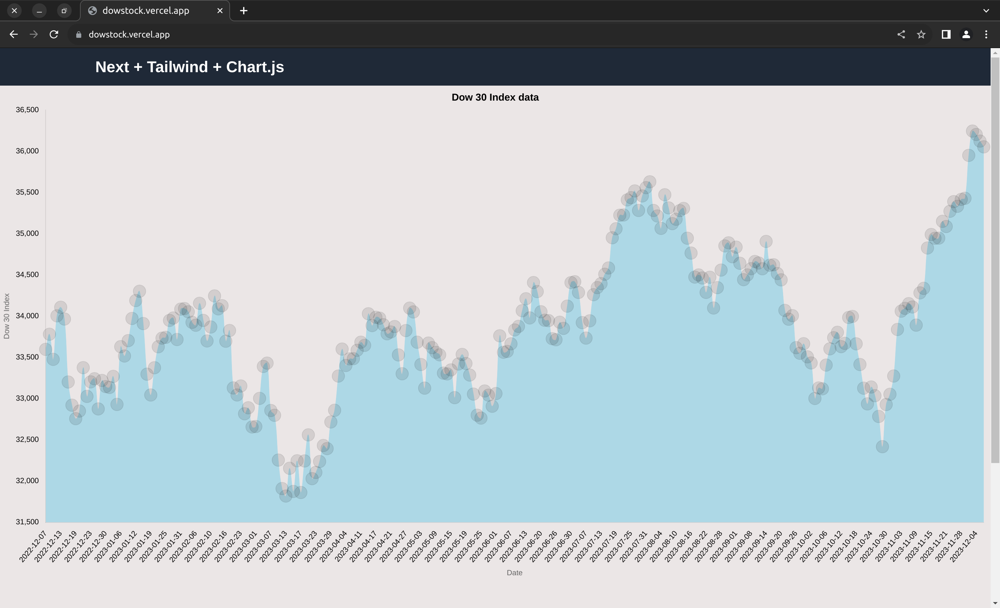

# Dow Stock

Simple Stocks app in Python and Next.js

## 📦 Tech Stack:

- [FastAPI](https://fastapi.tiangolo.com/)  - FastAPI framework, high performance, easy to learn, fast to code, ready for production.
-   [Next.js](https://nextjs.org/)  - The React Framework for the Web.
-   [Typescript](https://www.typescriptlang.org/)  - JavaScript with syntax for types.
-   [Tailwind 3](https://tailwindcss.com/)  - Rapidly build modern websites without ever leaving your HTML.

## Demo:

<a href="https://dowstock.vercel.app">

</a>


## Getting Started: 

- Clone repository 

```bash
mkdir ~/Dev/dow-stock -p
cd ~/Dev/dow-stock
git clone https://github.com/Arvind-4/dow-stock.git .
```  

- Install Dependencies **(Frontend)**:

```bash
cd ~/Dev/dow-stock
npm i
```

- Install Dependencies **(Backend)**:

```bash
cd ~/Dev/dow-stock
python3.8 -m pip install virtualenv
python3.8 -m virtualenv . 
source bin/activate
pip install -r requirements.txt
```

- Run Server **(Frontend)**:

```bash
npm run dev
```

- Run Server **(Backend)**:

```bash
bash scripts/run.sh
```

Open [localhost:3000](http://localhost:3000) for the Front end and [localhost:8000](http://localhost:8000) for Back end.
